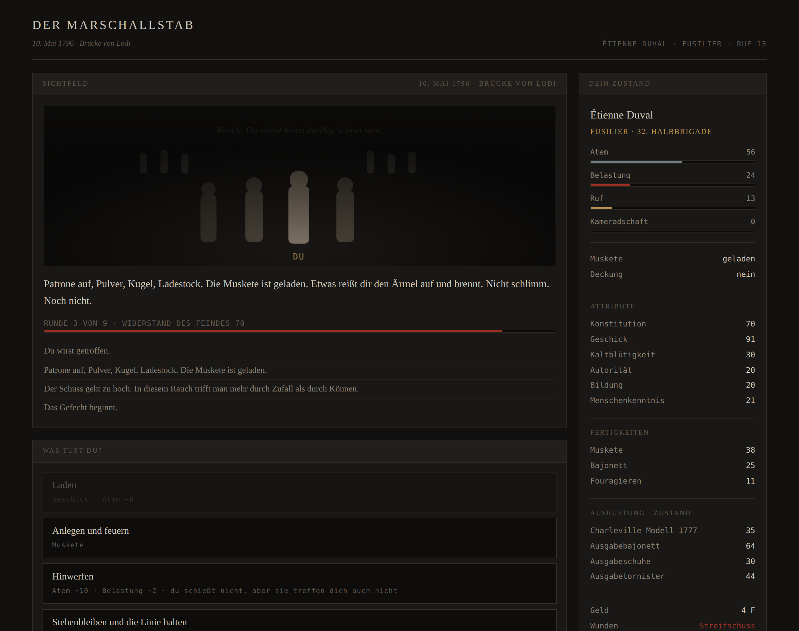

# Der Marschallstab

**Ein Karriere-Simulator in der Grande Armée, 1796–1815.**

Du beginnst als analphabetischer Rekrut mit einer Muskete, die dir nicht gehört. Wenn du zwanzig Jahre und sechs Feldzüge überlebst, hältst du vielleicht einen Marschallstab. Wahrscheinlicher liegst du 1796 in einem Graben bei Montenotte.

> ▶ **[Im Browser spielen](https://darktemplarxy.github.io/Soldier-RPG/)** — kein Download, keine Installation.



---

## Was das anders macht

Die meisten Spiele über Rangaufstieg geben dir größere Zahlen. Dieses gibt dir **andere Knöpfe**.

Als **Fusilier** steuerst du deinen eigenen Körper: laden, anlegen, feuern, hinwerfen. Du siehst vier Männer und Rauch — keine Karte, keine Feindstärke, kein Überblick.

Als **Voltigeur** kämpfst du allein vor der Linie: zielen, Deckung wechseln, frei bewegen. Ein anderes Minispiel, nicht bessere Werte.

Als **Caporal** kommen acht Männer dazu, und mit ihnen Befehle: Salve schießen lassen, die Lücke schließen.

Und mitten im Gefecht kommen Fragen, die keine Handgriffe sind. Der Adjutant sucht acht Mann für die Geschütze auf dem Hügel und sagt nicht, wofür. Der Adlerträger fällt, und der Adler steht schräg im Dreck, sechs Schritt vor der Linie, wo niemand steht. Vier Schritt weiter liegt einer und ruft, und hat keine Luft für laut. **Du kannst jedes Mal stehen bleiben.** Es kostet nichts und bringt nichts, und niemand sagt etwas dazu — weder jetzt noch später.

Weiter oben wird daraus eine Sektion, ein Zug, eine Kompanie, ein Bataillon. Beim Offizierspatent wird die Muskete eingezogen; ab dem Chef de bataillon sind Männer vier Rechtecke, und die Atemleiste verschwindet ersatzlos. Der General sieht am Ende eine Operationskarte und Meldungen, die vierzig Minuten alt und teilweise falsch sind. **Er sieht mehr und weiß weniger als der Fusilier.**

Dazu ein paar Regeln, die das Spiel zusammenhalten:

- **Der Tod ist endgültig.** Kein Weiterspielen, kein Nachfolger.
- **Nur der beste Lauf zählt.** Veteranenpunkte sind das Maximum über alle Läufe, nie die Summe — es gibt nichts zu grinden, nur zu übertreffen.
- **Dein erster Mann rückt mit sechzig Punkten ein und wird Ägypten sehr wahrscheinlich nicht überleben.** Das ist keine Strafe, sondern der Anfang: Was er erreicht, wird zum Startkapital des Nächsten. Gegner, gegen die du im ersten Lauf chancenlos bist, sind im dritten zu schlagen — nicht weil sie schwächer geworden sind, sondern weil du schneller lädst.
- **Beförderung braucht eine Vakanz.** Ruf und Fürsprache reichen nicht; die Stelle muss frei sein. Frei wird sie, weil jemand gestorben ist. Das Spiel sagt das nie, es zeigt es nur.
- **Ausrüstung ist ein Zustand, kein Besitz.** Schuhe halten einen Feldzug, keine zwei.
- **Konstitution kauft Zähigkeit, nicht Unverwundbarkeit.** Sie bestimmt, wie viele Treffer du wegsteckst — fünf bis acht, dann ist es vorbei. Die Zeit heilt, langsam; aber der Atem steigt nie über das Leben, und wer zerschossen weiterkämpft, kämpft kurzatmig.

Historische Fixpunkte, dazwischen freies Spiel: Montenotte, die Brücke von Lodi, Mantua, Castiglione, Arcole, Rivoli, Leoben — dann Alexandria, die Pyramiden, der Kairoer Aufstand, Akkon, Abukir und die Nacht, in der Bonaparte ohne seine Armee nach Frankreich segelt.

---

## Stand

**Alle elf Feldzüge sind spielbar** — Italien 1796/97, Ägypten 1798/99, die Garnison von Nîmes 1801–04, Austerlitz 1805, Jena–Auerstedt 1806, Eylau–Friedland 1807, Spanien 1808–12, Russland 1812, Deutschland 1813, Frankreich 1814 und die Hundert Tage 1815, zusammen einhundertsiebenundfünfzig Stationen, einundvierzig Gefechte, Lager, Winterquartiere und fünf Saisons.

Italien ist das Lehrstück: barfuß über die Pässe, die Brücke von Lodi, der Sumpf von Arcole. Ägypten ist etwas anderes — dort töten die Wege mehr Männer als die Gefechte. Hitzschlag im Marsch auf Damanhur, Ruhr am Sinai, das Fieber aus Jaffa auf dem Rückzug. Akkon fällt nicht, so wie es 1799 nicht gefallen ist, und nach Abukir liegt die Flotte auf dem Meeresgrund: Es gibt keinen Weg mehr nach Hause. Dann drei Jahre Frieden, in denen der Feind nicht die Kugel ist, sondern die Zeit — und danach Austerlitz, wo geprüft wird, was in diesen drei Jahren gelernt wurde.

1806 wird daraus etwas anderes: **Der Krieg wird mit den Beinen gewonnen.** Zwischen dem 8. Oktober und dem 7. November verschwindet die preußische Armee — nicht geschlagen, eingeholt. Vierzehn Tage wird marschiert und zwei Tage geschossen, und deshalb bekommt der Marsch selbst eine Entscheidung: Vor jedem langen Weg wählst du das Tempo. Wer forciert, kommt an, bevor der Weg zu Ende ist, und lässt eine ganze Station hinter sich, in der etwas zu holen gewesen wäre — für doppelten Verschleiß, Atem und wunde Füße. Wer schont, hat abends alle beisammen, und ein Adjutant mit einer Uhr schreibt auf, wann sein Bataillon eingetroffen ist.

1807 kommt der Winter dazu, und mit ihm die einzige Regel dieses Spiels, die nichts kostet als Voraussicht: **Wer keinen Mantel hat, verliert an jeder Nacht unter freiem Himmel Leben.** Der Beutemantel liegt seit dem ersten Kapitel im Kaufladen und war bis dahin der unscheinbarste Posten darin. Und bei Eylau schneit es waagerecht — dort steht kein Widerstandswert mehr auf dem Schirm, sondern eine Schätzung: „vielleicht die Hälfte“. Es ist zehn Ränge zu früh dasselbe Problem, das der General später mit seinen Meldungen hat.

Und 1808 kippt es. **In Spanien gibt es keinen Ruhm — nur Entscheidungen, bei denen niemand zusieht.** Die Bulletins schweigen über diesen Krieg, also gibt es keine Nennungen und keine Meldungen nach Paris; wer hier aufsteigen will, tut es über die Listen, die Kasse und den Zustand seiner Kompanie. Zwei der fünf Gefechte sind Überfälle: keine Linie, die von allein mitschießt, und Zurückweichen kostet keinen Ruf, weil niemand dabei ist. Dreimal stellt das Kapitel eine Frage, auf die es keine gute Antwort gibt. **Das Spiel wertet nie** — es führt nur Buch, und die Belastung ist das Buch.

1812 ist kein Feldzug mehr, sondern ein Vorrat, der kleiner wird. **Was kaputtgeht, bleibt kaputt** — der Marketender hat nichts, die Magazine sind leer, Ausrüstung nutzt sich doppelt ab und wird nicht ersetzt. An jeder einzelnen Station kostet dieser Krieg Leben, ohne dass jemand geschossen hätte: Posten, die nicht zurückkommen, Nachzügler, Fieber, ein Messer im Quartier. Die vier Gefechte sind dabei nicht die gefährlichsten des Spiels, und das ist Absicht — Borodino trägt seine Härte in der Länge, zehn Runden gegen den zähesten Widerstand, den es gibt. **Und am Njemen steht zum ersten Mal eine Schranke:** Wer lebt und unter dem Sous-Lieutenant geblieben ist, wird ausgemustert und geht in den Ruhestand. Wer darüber steht, darf wählen — weitergehen oder aufhören. Aufhören ist die höhere Wertung.

1813 kehrt der Krieg als etwas Neues zurück: **Deine Armee ist achtzehn Jahre alt.** Die alte liegt in Russland, und was am Rhein antritt, sind Konskribierte, die die Muskete zum ersten Mal halten, als man sie ihnen aushändigt. Deine Leute treten nicht mit voller Zahl an, sondern mit dem, was von einem Verband übrig ist, den es vor sechs Wochen noch nicht gab — und keine einzige Gefahr-Zahl ist dafür angehoben worden: Der Feind schießt nicht besser, deine Leute halten schlechter. Der Exerzierplatz wird damit zum eigentlichen Spiel, und der Drill zahlt hier doppelt. Es ist derselbe Drill wie in Savona 1796, nur stehst du auf der anderen Seite, und die Gesichter vor dir sind das eigene von damals. Das Kapitel sagt das genau einmal, in einem Nebensatz.

1814 kommt der Krieg nach Hause, und das Land will ihn nicht: Die Bauern verstecken das Korn vor der eigenen Armee, die Präfekten verhandeln schon. Und 1815 steht am Anfang ein Brief. **Der Rückruf ist eine echte Wahl** — wer ablehnt, bekommt kein schlechteres Ende, sondern ein anderes: Man liest es elf Tage später in der Zeitung, faltet sie und legt sie weg. Wer annimmt, steht bei Waterloo, und **danach kommt zum ersten Mal ein Epilog, der über den Tag hinaussieht** und sagt, was aus dem Mann geworden ist — bestimmt vom Rang, nicht vom Ausgang. Verloren haben alle.

Zwischen den Gefechten liegen Wege: 1 200 km von Savona bis Leoben, danach 4 000 km über See und durch die Wüste, jede Station mit Entfernung und Dauer. Vor jedem Gefecht steht der Anmarsch — der Nachtmarsch im Regen, die vier Stunden Warten in den Gassen von Lodi, die Lagemeldung und das, womit du dastehst. In den Lagern entscheidest du, was du mit den zwei oder drei Abenden anfängst: exerzieren, scharf schießen, die Schuhe zum Schuster tragen, die Muskete ölen, schlafen. Es ist immer mehr zu tun als Zeit da ist.

**Die Rangleiter steht ganz — alle vierzehn Ränge, und jeder spielt sich anders.** Der Fusilier steuert seinen Körper, der Caporal acht Männer, der Sergent eine Sektion von zwanzig, der Sergent-major einen Zug von sechzig. Beim Patent zum Sous-Lieutenant wird die Muskete eingezogen: Laden und Feuern verschwinden ersatzlos, an ihre Stelle treten Befehle, und aus dem Gefechtsbild wird eine Handskizze mit einem gestrichelten Feind. Ab dem Capitaine hat jedes Gefecht zwei Ziele, von denen nur eines der Sieg ist, und im Schrank liegt das Geld, mit dem hundertzwanzig Männer Schuhe bekommen sollen.

**Vier Mal in einer Laufbahn wird der Bildschirm ein anderer, und drei Mal davon verliert man dabei etwas.** Als Chef de bataillon sind Männer nur noch vier Rechtecke — und die Atemleiste, auf die man zehn Ränge lang geschaut hat, ist weg. Ersatzlos, ohne Kommentar. Als Général de brigade ist der Feind keine Zahl mehr, sondern eine Meldung mit Uhrzeit und Verlässlichkeit, und was darin steht, ist vierzig Minuten alt. Der General sieht mehr und weiß weniger; der Fusilier sah vier Männer und Rauch, aber was er sah, war wahr.

**Und du kommst dorthin.** Wer einmal Sergent-major war, kann sich beim nächsten Mann ein **Offizierspatent** kaufen: Er rückt 1796 in Savona mit Epauletten ein, hat nie eine Muskete abgefeuert, und niemand in der Kompanie kennt ihn. Martel, Collot, Berthaud und Vernet stehen bei null, und die Abende am Feuer, an denen man sie kennenlernt, stehen einem Offizier nicht offen. Er ist mechanisch stärker und sozial nackt — und er überlebt in acht von hundert Läufen. Der Kauf erhöht auch nie den Punktevorrat; er zeigt dir die andere Hälfte des Spiels, mehr nicht.

**Und was du getan hast, steht am Rock.** Neun Auszeichnungen, und man erkennt an der Form, was für eine es ist, bevor man den Namen liest: ein Staatsorden ist ein Kreuz am Band, eine Gefechtsauszeichnung eine geprägte Scheibe an der Trikolore, eine Ehrenwaffe ein Gegenstand auf einem Täfelchen, in das dein Name graviert ist. Sie kommen nie aus einem Würfelwurf — man soll hinterher genau sagen können, wofür. Der Ehrensäbel verlangt eine Kette ohne einen einzigen Fehlschlag: Wer durch die Bresche von Akkon gegangen ist, ohne zu straucheln, bekommt nicht dasselbe wie einer, der dreimal aufgefallen ist.

Entworfen, aber noch nicht gebaut: die Generalskampagnen als eigene Szenarien. Das vollständige Design steht in [`KONZEPT.md`](KONZEPT.md), die Leiter in [`RANGLEITER.md`](RANGLEITER.md).

Und die Gegner wachsen mit: Jede Kampagne trägt eine Güte-Zahl, die bestimmt, wie gut der Feind schießt und wie lange er steht. Beaulieus geschlagene Kolonnen laufen von allein; Dschesärs Garnison in Akkon läuft nicht, und die russische Garde auf dem Pratzeberg auch nicht. Wer alles schafft, hat einhundertsiebenundfünfzig Stationen und neunzehn Jahre hinter sich — und einen Epilog, der sagt, was aus ihm geworden ist.

---

## Spielen

`index.html` im Browser öffnen. Doppelklick genügt — kein Server, kein Build, keine Abhängigkeiten. Zum Weitergeben liegt dieselbe Fassung als einzelne Datei unter `dist/marschallstab.html`.

Links steht der Weg: alle elf Feldzüge, auf- und zuklappbar. Innerhalb eines Feldzugs siehst du nur die Stationen, die du mindestens einmal betreten hast — was danach kommt, weißt du nicht. Was du einmal gesehen hast, bleibt über den Tod hinaus sichtbar.

Der angefangene Feldzug wird selbsttätig gesichert — beim Betreten eines Lagers wird es angesagt, danach still nach jedem Schritt. Wer aufhört, kommt genau dorthin zurück, wo er war. **Wer fällt, verliert den Spielstand im selben Augenblick:** Der Aussetz-Spielstand ist zum Aufhören da, nicht zum Wiederholen.

Chronik und laufender Feldzug lassen sich über „Spielstand sichern" zusätzlich als Datei herunterladen und später wieder laden. Die Datei bleibt das maßgebliche Format; der Browser-Speicher ist nur dafür da, dass ein Absturz keinen Feldzug kostet.

---

## Entwickeln

```bash
npm install playwright && npx playwright install chromium

node test/durchspielen.js     # spielt einen Lauf durch, meldet Konsolenfehler
node test/raenge.js           # alle vierzehn Ränge: stimmen Knöpfe, Bild und das, was fehlt
node test/spielstand.js       # sichern, fortsetzen, sterben, alte Fassungen
node test/balance.js 40       # 40 Läufe, misst die Überlebensquote
node werkzeug/bauen.js        # baut dist/marschallstab.html
```

Findet Playwright den Browser nicht: `CHROMIUM=/pfad/zu/chrome node test/…`

```
index.html                      lädt die Skripte in fester Reihenfolge
src/stil.css
src/daten/grundwerte.js         Attribute, Fertigkeiten, Ränge, Herkünfte, Kaufladen
src/daten/kapitel01_italien.js  Kapitel 1 als reine Daten
src/daten/kapitel02_aegypten.js Kapitel 2, hängt sich selbst an die Kette
src/spielstand.js               Fassungen, Wandler, Ablage, Aussetz-Spielstand
src/mechanik.js                 Laufzustand, Proben, Wachstum, Verschleiß, Wunden
src/oberflaeche.js              Titel, Erschaffung, Ablauf, Szenen
src/kampf.js                    Anmarsch, Gefecht, Elitekompanie, Beförderung
src/abschluss.js                Lager, Winterquartier, Wertung, Tod, Spielstand
src/start.js                    Einstiegspunkt
```

Klassische Skripte statt ES-Module — damit `index.html` per Doppelklick über `file://` läuft. Bitte so lassen; Module scheitern dort an der Sicherheitsprüfung des Browsers.

---

## Mitmachen

Vor dem ersten Beitrag bitte **[`CLAUDE.md`](CLAUDE.md)** lesen. Dort stehen die acht Design-Invarianten und **jede Balance-Zahl mit Begründung** — etwa warum die Trefferchance bei Lodi 15 ist und nicht 38, und warum die Zeile `feindMoral -= schaden + linie` nicht entfernt werden darf. (Ohne sie sind alle Gefechte rechnerisch unmöglich zu gewinnen. Das ist getestet worden, mit 100 % Verlusten.)

Wer eine Balance-Zahl ändert, trägt sie in `CLAUDE.md` und `AENDERUNGEN.md` nach und lässt `node test/balance.js 40` laufen.

Neue Kapitel kommen als eigene Datendatei nach `src/daten/` und enthalten keine Logik.

**Ton der Texte:** nüchtern-brutal, zweite Person, Präsens. Konkrete Zahlen statt Adjektive. Das Spiel wertet nicht und sagt nie, ob eine Entscheidung richtig war.

---

## Dokumente

| Datei | Inhalt |
|---|---|
| [`KONZEPT.md`](KONZEPT.md) | Vollständiges Designdokument: elf Kapitel, vierzehn Ränge, Punkteökonomie, Simulationen |
| [`CLAUDE.md`](CLAUDE.md) | Design-Invarianten und alle Balance-Konstanten mit Begründung |
| [`AENDERUNGEN.md`](AENDERUNGEN.md) | Änderungsprotokoll, inklusive der vier Balance-Fassungen von 100 % auf 50 % Verluste |
| [`entwurf/`](entwurf/) | Konzeptgrafiken: Maßstabswechsel, Progression, Ausrüstung und Orden |

---

## Lizenz

**Code** unter der MIT-Lizenz — siehe [`LICENSE`](LICENSE).

**Spielinhalte** (Texte, Szenen, Design, Grafiken) unter [CC BY-NC-SA 4.0](https://creativecommons.org/licenses/by-nc-sa/4.0/deed.de) — siehe [`LICENSE-INHALTE`](LICENSE-INHALTE). Verwenden und verändern ausdrücklich erlaubt, kommerziell verwerten nicht.
